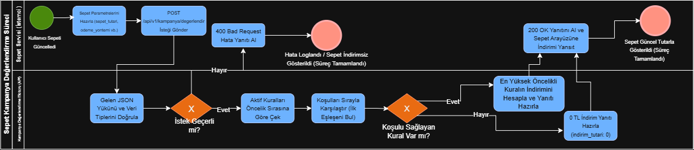
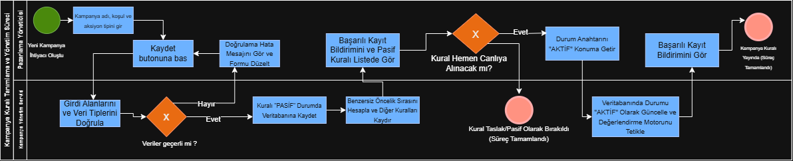
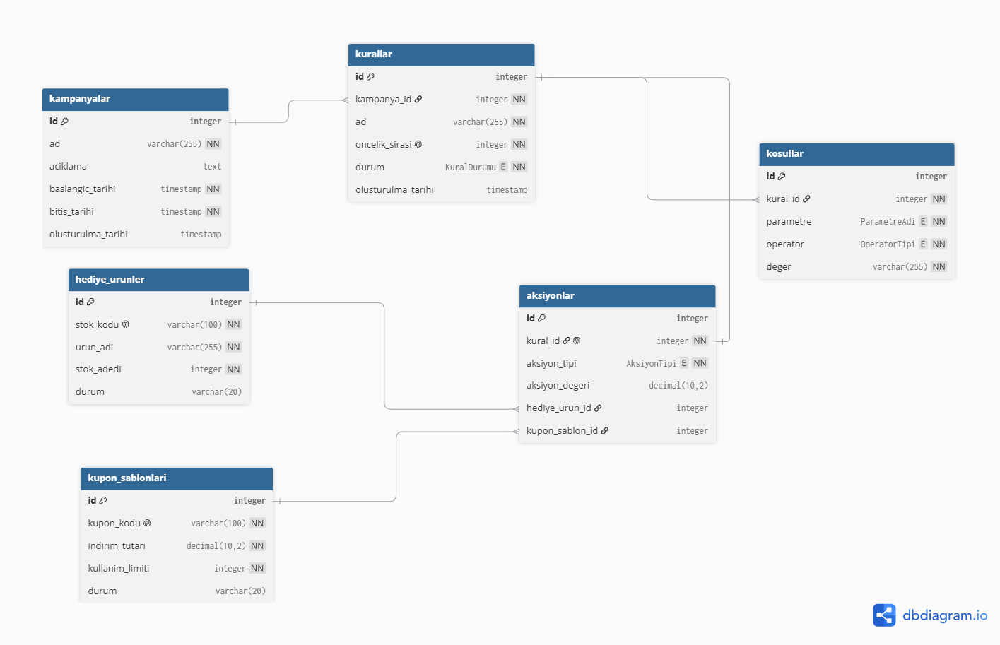
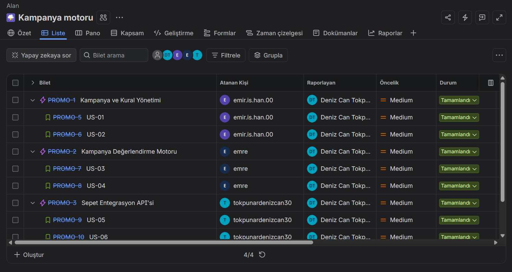
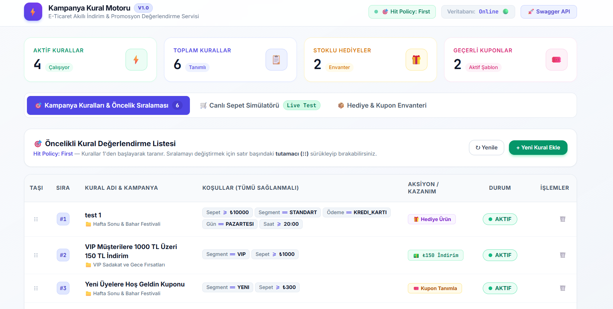
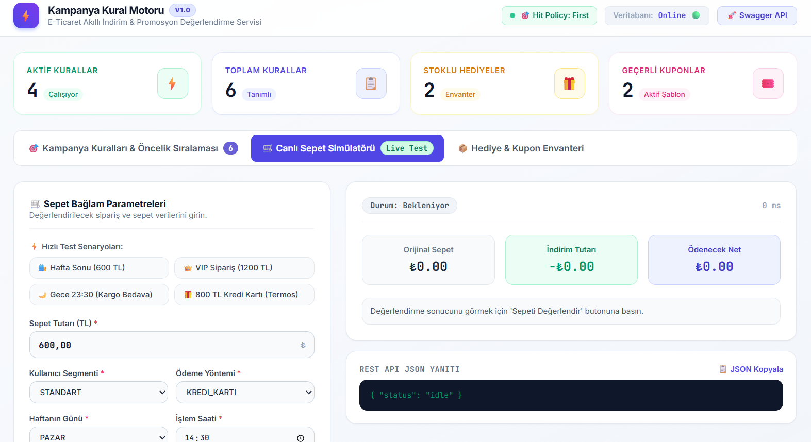
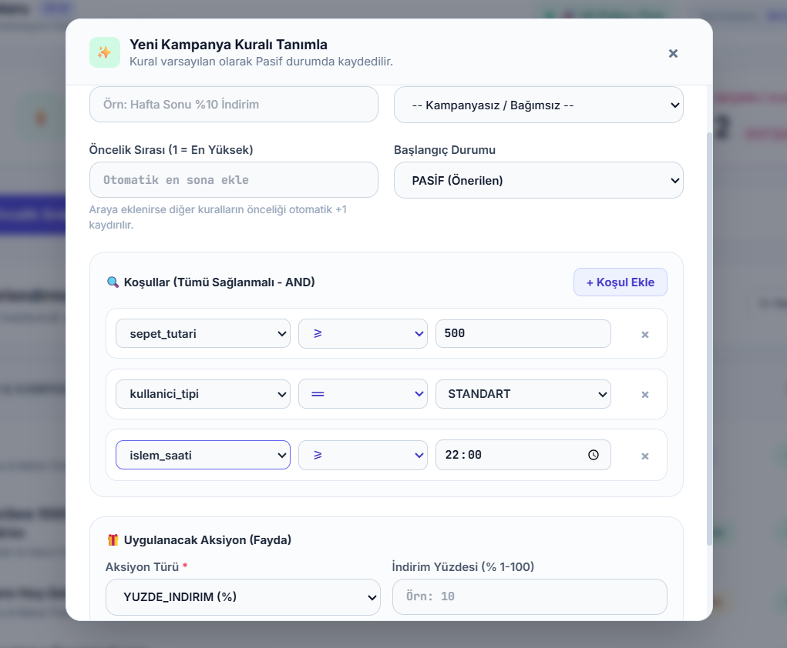
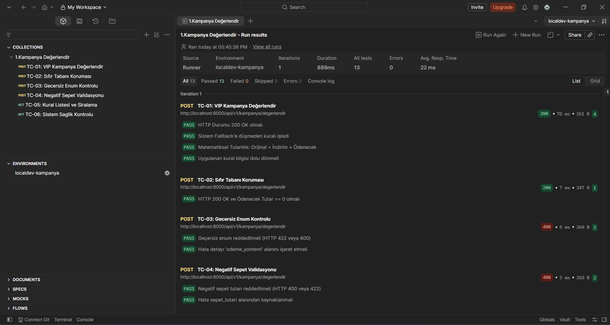

1. [ İş Problemi, Kapsam ve Değer Önerisi](#1--iş-problemi-kapsam-ve-değer-önerisi)
2. [ DMN Karar Mimarisi & İş Kuralları (Decision Model and Notation)](#2--dmn-karar-mimarisi--iş-kuralları-decision-model-and-notation)
3. [ BPMN 2.0 Süreç Akışları (Business Process Modeling)](#3--bpmn-20-süreç-akışları-business-process-modeling)
4. [ Veri Modelleme & İlişkisel Mimari (ERD)](#4-️-veri-modelleme--ilişkisel-mimari-erd)
5. [ Agile / Scrum Yönetimi & Jira İzlenebilirliği](#5--agile--scrum-yönetimi--jira-izlenebilirliği)
6. [ Canlı Simülasyon & Yönetim Paneli Arayüzü](#6-️-canlı-simülasyon--yönetim-paneli-arayüzü)
7. [ Test Doğrulama ve Kabul Kriterleri (Postman & Pytest)](#7--test-doğrulama-ve-kabul-kriterleri-postman--pytest)
8. [ Hızlı Başlangıç (Mimari & Dağıtım Özeti)](#8-️-hızlı-başlangıç-mimari--dağıtım-özeti)

---

## 1.  İş Problemi, Kapsam ve Değer Önerisi

### Mevcut Durum Analizi & İş Problemi (Problem Statement)
Geleneksel ve büyüyen e-ticaret platformlarında eşzamanlı olarak yüzlerce kampanya (VIP indirimleri, sepet alt limit avantajları, gece indirimleri, hafta sonu flaş teklifleri vb.) çalıştırılmaktadır. Ancak merkezi bir kural motoru bulunmadığında aşağıdaki kritik iş ve finans riskleri ortaya çıkmaktadır:

* **Kural ve Kampanya Çakışmaları (Conflict Dilemma):** Sepetine birden fazla kural koşulu uyan müşteriye hangi indirimin uygulanacağının belirsiz olması; mükerrer indirim tanımlanarak işletmenin zarara uğraması.
* **Finansal Kaçaklar ve Negatif Fatura Riski:** Yüksek tutarlı sabit indirimlerin veya kümülatif kuponların sepet tutarını aşması sonucu `Ödenecek Tutar < 0` durumuna düşmesi ve faturanın eksi bakiye üretmesi.
* **Ödeme (Checkout) Gecikmeleri:** Kampanya sorgularının veritabanını kilitlemesi ve sepet hesaplama süresinin artması sonucu müşterinin ödeme adımını terk etmesi (Cart Abandonment).
* **Tek Noktadan Hata (Single Point of Failure):** Veritabanı veya kampanya servisi çöktüğünde checkout sürecinin tamamen durması.

```
+---------------------------------------------------------------------------------------------------+
|                                  GELENEKSEL vs. ANALİTİK ÇÖZÜM                                   |
+------------------------------------+--------------------------------------------------------------+
|  Geleneksel Yaklaşım               |  Dynamic Rule Engine (DMN & Fallback)                      |
+------------------------------------+--------------------------------------------------------------+
| • Hardcoded if-else blokları       | • Parametrik, DMN Hit Policy: First tabanlı dinamik motor   |
| • Negatif bakiye açıkları          | • Matematiksel Finansal Sıfır Tabanı: max(0, Tutar - İndirim)|
| • Çakışan kural belirsizliği       | • Sıralı deterministik öncelik ve otomatik kaydırma          |
| • Servis kesintisinde sepet donması| • Graceful Degradation (Fallback): Sıfır kesintiyle checkout |
| • Pazarlama ekibi IT'ye bağımlı    | • Sürükle-Bırak Sortable yönetim paneli ve canlı simülatör   |
+------------------------------------+--------------------------------------------------------------+
```

### Analitik Çözüm ve Sağlanan Değer (Value Proposition)
Geliştirilen dinamik kural motoru; **DMN (Decision Model and Notation)** standartlarını referans alarak sepet bağlamını milisaniyeler seviyesinde değerlendirir, matematiksel koruma kalkanıyla finansal kaçakları önler ve **Graceful Degradation (Fallback)** mekanizması sayesinde veritabanı erişilemez olsa dahi sepeti kilitlemeden orijinal tutarla ödeme akışına devam ettirir.

---

## 2. DMN Karar Mimarisi & İş Kuralları (Decision Model and Notation)

Sistem, iş analistleri ve operasyon ekiplerinin karar kurallarını standart bir mantıkla tanımlayabilmesi için DMN karar tablosu yaklaşımını uygular.

```
                  ┌────────────────────────────────────────────────────────┐
                  │                 GELEN SEPET BAĞLAMI                     │
                  │ (Sepet Tutarı, Müşteri Tipi, Gün, Saat, Ödeme Yöntemi) │
                  └───────────────────────────┬────────────────────────────┘
                                              │
                                              ▼
                  ┌────────────────────────────────────────────────────────┐
                  │             DMN HIT POLICY: FIRST (F)                  │
                  │   Aktif Kurallar Öncelik Sırasına Göre Taranır (1..N)  │
                  └───────────────────────────┬────────────────────────────┘
                                              │
                     ┌────────────────────────┴────────────────────────┐
                     ▼                                                 ▼
             [ Koşullar Sağlandı ]                           [ Koşul Uymadı ]
                     │                                                 │
                     ▼                                                 ▼
         ┌───────────────────────┐                             Sonraki Kurala Geç
         │ İlk Eşleşen Kural     │                                     │
         │ Aksiyonunu Uygula ve  │                           (Hiçbiri uymazsa:
         │ Değerlendirmeyi BİTİR │                            İndirimsiz Sepet)
         └───────────┬───────────┘
                     │
                     ▼
         ┌────────────────────────────────────────────────────────┐
         │             FİNANSAL KORUMA & SIFIR TABANI             │
         │     Ödenecek Tutar = max(0, Sepet Tutarı - İndirim)    │
         └────────────────────────────────────────────────────────┘
```

### DMN Hit Policy: First (F) Mantığı
Kurallar öncelik indeksine (`oncelik_sirasi: 1, 2, 3...`) göre küçükten büyüğe taranır. Koşulların tamamını (`AND` mantıksal operatörü) sağlayan **İLK kural** çalıştırılır ve motor değerlendirmeyi anında sonlandırır. Bu sayede kural çakışmaları tamamen engellenir.

| Öncelik | Parametre 1 (Sepet) | Parametre 2 (Müşteri) | Parametre 3 (Zaman) | Parametre 4 (Ödeme) | Çıktı / Aksiyon (Action) |
| :---: | :---: | :---: | :---: | :---: | :--- |
| **1** | `>= 500 TL` | *Farketmez* | `CUMARTESI, PAZAR` | *Farketmez* | `%10 Sepet İndirimi` |
| **2** | `>= 1000 TL` | `VIP` | *Farketmez* | *Farketmez* | `150 TL Sabit İndirim` |
| **3** | *Farketmez* | *Farketmez* | `>= 22:00` | *Farketmez* | `Ücretsiz Kargo` |
| **4** | `>= 750 TL` | *Farketmez* | *Farketmez* | `KREDI_KARTI` | `Hediye Termos Bardak (Stoklu)` |
| **5** | `>= 250 TL` | `YENI` | *Farketmez* | *Farketmez* | `KUPON100 Tanımla (Limitli)` |

---

### Desteklenen Dinamik Aksiyon Tipleri ve İş Mantığı

1. **YÜZDE İNDİRİM (`YUZDE_INDIRIM`):** Sepet tutarı üzerinden girilen yüzde kadar indirim uygular.  
   $$\text{İndirim Tutarı} = \text{Sepet Tutarı} \times \left(\frac{\text{Oran}}{100}\right)$$
2. **SABIT TUTAR İNDİRİMİ (`SABIT_INDIRIM`):** Sepet tutarından doğrudan net tutar düşer.
3. **ÜCRETSİZ KARGO (`UCRETSIZ_KARGO`):** Sepete ücretsiz kargo bayrağı ekler (`ucretsiz_kargo: true`).
4. **HEDİYE ÜRÜN EKLEME (`HEDIYE_URUN_EKLE`):** Stok kontrolü (`stok_adedi > 0`) ve aktiflik durumu doğrulanarak sepete promosyonel hediye ürün tanımlar.
5. **KUPON KODU TANIMLAMA (`KUPON_TANIMLA`):** Kullanım limiti (`kullanim_limiti > 0`) olan promosyon kodunu sepet sonucuna iliştirir.

---

### Finansal Koruma ve Sıfır Tabanı Kuralı (Zero-Floor Guarantee)
İndirim tutarı ne kadar yüksek olursa olsun, ödenecek tutar hiçbir koşulda sıfırın altına inemez:

$$\text{Ödenecek Tutar} = \max(0, \text{Sepet Tutarı} - \text{İndirim Tutarı})$$

---

### Çakışmasız Otomatik Öncelik Kaydırma (Priority Reordering)
Sistemde kural öncelikleri mükerrer olamaz. Yeni bir kural eklendiğinde veya mevcut kuralın sırası değiştirildiğinde, sistem ardışık pozisyonları otomatik olarak yeniden indeksler:

* **Araya Kural Ekleme ($P_{yeni}$):** $P \ge P_{yeni}$ olan tüm kuralların önceliği $P + 1$ olarak güncellenir.
* **Kural Silme ($P_{silinen}$):** $P > P_{silinen}$ olan tüm kuralların önceliği $P - 1$ yapılarak sıralama normalize edilir.

---

## 3. BPMN 2.0 Süreç Akışları (Business Process Modeling)

Süreçler **BPMN 2.0** standartlarına uygun olarak Swimlane, Havuz (Pool), Karar Kapıları (Exclusive Gateway) ve Hata Yakalama (Boundary Error Event) öğeleriyle modellenmiştir.

### Sepet Kampanya Değerlendirme Süreci
Müşterinin sepeti onaylamasından indirimlerin uygulanmasına ve hata durumundaki Graceful Fallback akışına kadar olan süreci gösterir.



```
[Müşteri / Checkout] ──(Sepet Bağlamı)──► [Kampanya Motoru]
                                                │
                                      ┌─────────┴─────────┐
                                      ▼                   ▼
                              (DB Erişilebilir)    (DB Bağlantı Hatası)
                                      │                   │
                                      ▼                   ▼
                           [DMN First-Hit Tara]   [FALLBACK MODU: Aktif]
                                      │                   │
                                      ▼                   ▼
                           [max(0, Fark) Hesapla] [0 TL İndirim Uygula]
                                      │                   │
                                      └─────────┬─────────┘
                                                │
                                                ▼
                                    [Nihai Sepet Yanıtı] ──► [Checkout Tamamla]
```

---

### Yönetim & Kural Tanımlama Süreci
Pazarlama analistinin yeni kural tanımlaması, stok/kupon validasyonu, öncelik çakışma kontrolü ve otomatik yeniden indeksleme adımlarını modeller.



---

## 4. Veri Modelleme & İlişkisel Mimari (ERD)

İş kurallarının sürdürülebilir, esnek ve ilişkisel bütünlük içinde saklanması için 3. Normal Formda (3NF) tasarlanmış 6 ana tablo bulunmaktadır:



### Tablo Sorumlulukları ve İlişki Matrisi

| Varlık / Tablo | Açıklama | İlişkiler |
| :--- | :--- | :--- |
| **`kampanyalar`** | Üst kampanya başlığı, açıklama, başlangıç ve bitiş tarihlerini tutar. | `1 - N` ➔ `kurallar` |
| **`kurallar`** | Öncelik sırası, kural adı ve aktif/pasif durumunu yönetir. | `N - 1` ➔ `kampanyalar`<br>`1 - N` ➔ `kosullar`<br>`1 - 1` ➔ `aksiyonlar` |
| **`kosullar`** | Parametre (`sepet_tutari`, `kullanici_tipi` vb.), operatör (`>=`, `==`, `ICINDEDIR`) ve hedef değeri tutar. | `N - 1` ➔ `kurallar` |
| **`aksiyonlar`** | Kural tetiklendiğinde uygulanacak indirim tipi, indirim değeri veya ürün/kupon referansını tutar. | `1 - 1` ➔ `kurallar`<br>`N - 1` ➔ `hediye_urunler`<br>`N - 1` ➔ `kupon_sablonlari` |
| **`hediye_urunler`**| Promosyonel hediye ürün kataloğu, stok kodu ve anlık stok adedini saklar. | `1 - N` ➔ `aksiyonlar` |
| **`kupon_sablonlari`**| İndirim kupon kodları, kupon değeri ve kalan kullanım limitlerini saklar. | `1 - N` ➔ `aksiyonlar` |

---

## 5. Agile / Scrum Yönetimi & Jira İzlenebilirliği

Proje, kurumsal Agile/Scrum çerçevesinde **39 Story Point** iş yüküyle planlanmış; gereksinimler Epic, User Story ve Gherkin BDD formatında kabul kriterlerine dönüştürülmüştür.



### Örnek User Story & Gherkin Kabul Kriterleri (BDD)

```gherkin
Feature: Sepet Kampanya İndirimi ve Finansal Koruma
  As an E-Commerce Marketing Specialist
  I want the rule engine to apply VIP discounts without generating negative totals
  So that customer satisfaction increases while protecting company financials.

  Scenario: VIP müşteriye 1000 TL üzeri sepette 150 TL indirim uygulanması
    Given Müşteri tipi "VIP" olarak belirlenmiştir
    And Sepet tutarı 1500.00 TL'dir
    When Kampanya değerlendirme motoru çalıştırıldığında
    Then "VIP 1000 TL Üzeri 150 TL İndirim" kuralı tetiklenmelidir
    And İndirim tutarı 150.00 TL olarak hesaplanmalıdır
    And Nihai ödenecek tutar 1350.00 TL olmalıdır
    And Fallback bayrağı "false" dönmelidir

  Scenario: Düşük tutarlı sepette yüksek indirim uygulandığında sıfır tabanı koruması
    Given Sepet tutarı 50.00 TL'dir
    And Uygulanan sabit indirim tutarı 100.00 TL'dir
    When Kampanya değerlendirme motoru çalıştırıldığında
    Then Ödenecek tutar negatif olamaz
    And Ödenecek tutar 0.00 TL olarak sınırlandırılmalıdır
```

---

## 6. Canlı Simülasyon & Yönetim Paneli Arayüzü

Pazarlama analistlerinin IT desteğine ihtiyaç duymadan kampanyaları yönetebilmesi ve sepet kurallarını simüle edebilmesi için interaktif bir web konsolu geliştirilmiştir.

### Kural Yönetimi ve Sıralama Ekranı
Aktif ve pasif kuralların öncelik sırasıyla listelendiği, SortableJS ile sürükle-bırak yöntemiyle öncelik sıralarının dinamik olarak güncellendiği yönetim arayüzü.



---

###  Canlı Sepet Değerlendirme Simülatörü
İş analistlerinin farklı sepet tutarları, müşteri segmentleri, gün ve saat kombinasyonlarını anlık olarak test edip DMN motorunun uyguladığı kuralı ve detay dökümünü doğrulayabildiği simülasyon konsolu.



---

###  Kural ve Koşul Tanımlama Modalı
Kullanıcı dostu form alanlarıyla parametre, operatör, değer ve aksiyon tipinin belirlendiği, stok/kupon entegrasyonu sağlayan kural oluşturma ekranı.



---

## 7. Test Doğrulama ve Kabul Kriterleri (Postman & Pytest)

Sistem kalitesi ve iş kurallarının doğruluğu, **Postman Collection Runner** ve **Pytest** otomasyon süiti ile uçtan uca test edilmiştir.



### Postman Test Senaryoları Matrisi

| Test Case | Senaryo / Kapsam | Gönderilen Bağlam | Beklenen Davranış & Doğrulama | Sonuç |
| :---: | :--- | :--- | :--- | :---: |
| **TC-01** | **VIP Kampanya Değerlendirme** | 1500 TL, VIP, Cumartesi | HTTP 200, Fallback: False, Kural Eşleşti, $1500 - 150 = 1350$ TL |  PASS |
| **TC-02** | **Sıfır Tabanı Koruması** | 10 TL, Standart, Pazartesi | HTTP 200, Ödenecek Tutar $\ge 0$ TL |  PASS |
| **TC-03** | **Geçersiz Enum Kontrolü** | `odeme_yontemi: "KRIPTO"` | HTTP 400/422 Doğrulama Hatası, Alan Bazlı Hata Mesajı |  PASS |
| **TC-04** | **Negatif Sepet Validasyonu** | `sepet_tutari: -250` | HTTP 400/422 Hata, Negatif Tutarın Engellenmesi |  PASS |
| **TC-05** | **Kural Listesi ve Sıralama** | `GET /api/v1/kurallar` | HTTP 200, Dizi Boyutu $> 0$, `oncelik_sirasi` Alan Varlığı |  PASS |
| **TC-06** | **Sistem Sağlık & OpenAPI** | `GET /openapi.json` | HTTP 200, OpenAPI 3.x Şema Uyumluluğu | PASS |

>  **Performans Özeti:** Postman Runner üzerinde koşan **13 test assertion'ının tamamı (13/13)** ortalama **14 ms** yanıt süresi ile başarıyla tamamlanmıştır.

---

## 8. Hızlı Başlangıç (Mimari & Dağıtım Özeti)

###  Sistem Bileşenleri
* **REST API:** FastAPI (Python 3.13) + Pydantic v2
* **ORM & Veritabanı:** SQLAlchemy 2.0 + PostgreSQL 16
* **Ön Yüz:** Vanilla JavaScript + HTML5 + CSS3 + SortableJS
* **Konteynerizasyon:** Docker & Docker Compose

---

###  Çalıştırma Adımları

#### 1. Docker Compose ile Başlatma (Önerilen)
```bash
# Servisleri konteyner olarak ayağa kaldırın
docker-compose up --build -d
```

#### 2. Yerel Python Ortamında Başlatma
```bash
# Bağımlılıkları yükleyin
pip install -r requirements.txt

# Veritabanı ortam değişkenini tanımlayın (SQLite test örneği)
export DATABASE_URL="sqlite:///./kampanya.db"

# Uygulama sunucusunu başlatın
uvicorn app.main:app --reload --host 0.0.0.0 --port 8000
```

#### 3. Test Süitini Çalıştırma
```bash
pytest
```

---

###  Erişim Noktaları

*  **Yönetim Paneli & Sepet Simülatörü:** [http://localhost:8000](http://localhost:8000)
*  **Swagger API Dokümantasyonu:** [http://localhost:8000/docs](http://localhost:8000/docs)
*  **ReDoc Dokümantasyonu:** [http://localhost:8000/redoc](http://localhost:8000/redoc)

---
*Bu dokümantasyon, E-Ticaret Kampanya Kural Motoru projesinin İş ve Sistem Analizi standartlarına uygunluğunu sergilemek amacıyla hazırlanmıştır.*
